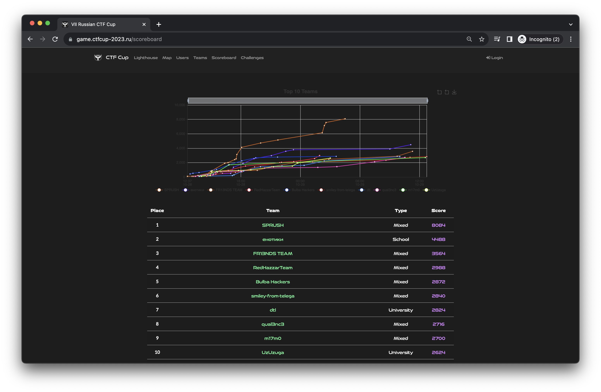

# Отборочный этап VII Кубка CTF России
Исходные коды, разборы, сплоиты и файлы для деплоя заданий с отборочного тура VII Кубка CTF России, который проходил 28-29 октября 2023 года онлайн. Задания разрабатывала команда [C4T BuT S4D](https://github.com/C4T-BuT-S4D).

[Сайт соревнования](https://ctfcup.ru/)

- Организаторы: **АРСИБ** и **ВОД «Наставники России»**
- Генеральный партнер: **RDP**
- Официальные партнеры: **Сбер** и **Газпромбанк**
- Специальный партнер: **Positive Technologies**
- Технологические партнеры: **EdgeCenter**, **UserGate** и **C4T BuT S4D**

# Результаты

[Весь скорборд](scoreboard/full.png)

# Информация
- Руководитель проекта: [@deviantwish](https://github.com/deviantwish)
- Технический директор: [@bysmaks](https://github.com/bysmaks)
- Тимлид: [@jnovikov](https://github.com/jnovikov)
- DevOps: [@pomo-mondreganto](https://github.com/pomo-mondreganto)

# Задания
| Название | Категория | Автор|
|------|-----------|-------|
| [gamer2](tasks/forensic/gamer) | forensics | [@qumusabel](https://github.com/qumusabel) |
| [zion](tasks/forensic/zion) | forensics | [@asokol123](https://github.com/asokol123) |
| [zion-revenge](tasks/forensic/zion-revenge) | forensics | [@asokol123](https://github.com/asokol123) |
| [monitoring](tasks/reverse/monitoring) | reverse | [@renbou](https://github.com/renbou) |
| [magick_lock](tasks/reverse/magick_lock) | reverse | [@falamous](https://github.com/falamous) |
| [time_capsule](tasks/reverse/time_capsule) | reverse | [@falamous](https://github.com/falamous) |
| [2fac](tasks/reverse/2fac) | reverse | [@qumusabel](https://github.com/qumusabel) |
| [novosti](tasks/web/novosti) | web | [@renbou](https://github.com/renbou) |
| [waf](tasks/web/waf) | web | [@jnovikov](https://github.com/jnovikov) |
| [scanner](tasks/web/scanner) | web | [@jnovikov](https://github.com/jnovikov) |
| [mistakes](tasks/web/mistakes) | web | [@Slonser](https://github.com/Slonser) |
| [murdata](tasks/crypto/murdata) | crypto | [@jnovikov](https://github.com/jnovikov) |
| [geometry](tasks/crypto/geometry) | crypto | [@falamous](https://github.com/falamous) |
| [lateralus](tasks/crypto/lateralus) | crypto | [@falamous](https://github.com/falamous) |
| [more_heap](tasks/pwn/more_heap) | pwn | [@user39043346](https://github.com/user39043346) |
| [some_storage](tasks/pwn/some_storage) | pwn | [@user39043346](https://github.com/user39043346) |
| [spy](tasks/pwn/spy) | pwn | [@b1r1b1r1](https://github.com/b1r1b1r1) |
| [gamer1](tasks/msc/gamer) | misc | [@qumusabel](https://github.com/qumusabel) |
| [Floating in Delirium](tasks/ppc/floating_in_delirium) | misc | [@falamous](https://github.com/falamous) |
| [checkpoint](tasks/ppc/checkpoint) | ppc | [@renbou](https://github.com/renbou) |
| [slons](tasks/ppc/slons) | ppc | [@Slonser](https://github.com/Slonser)|
