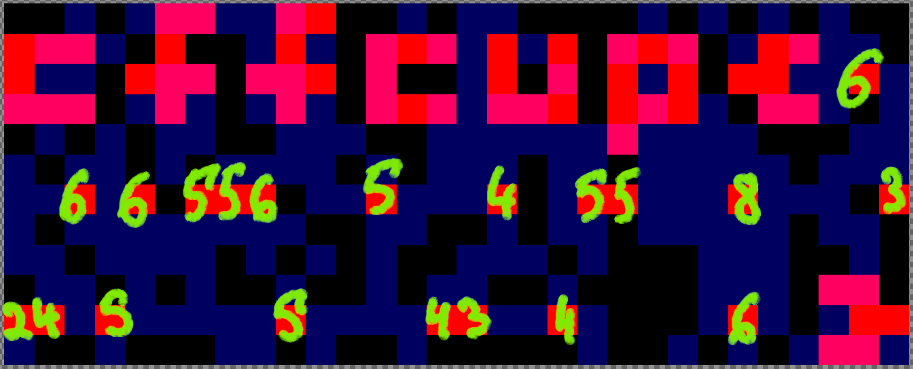

# msc | Gamer

## Information
*Часть первая.* Один из моих бывших агентов решил сэкономить и согласился установить вместо нормального импланта какую-то рухлядь с Земли, 
и перед глазами у него постоянно мелькало окно с какой-то древней игрой, которую невозможно было закрыть. Делать нечего — 
чувак начал играть целыми сутками, и кажется доигрался до навязчивого психоза. Помоги спасти парня, пока он не натворил никаких дел.

Формат флага — `ctfcup{\d{20}}`

*Part One*. One of my former agents decided to save money and agreed to have some junk from Earth installed instead of a normal implant, 
and he kept seeing a window with some ancient game in front of his eyes that he couldn't close. There was nothing to do - 
the dude's been playing all day and night, and it seems he's gone into obsessive compulsive psychosis. Help save the guy before he does any more damage.

Flag format — `ctfcup{\d{20}}`

## Public
Provide for-misc-gamer.7z to players.

for-misc-gamer.7z: `e0129d4b8eb37cc24c3c234ea25b21ff53094264ec72b5977067c5da76e6e463`

## TL; DR
Figure out digits under the flags on a Minesweeper board, assemble into the flag.

A [script](solve/show_board.py) was used to generate the image below:

## Writeup (ru)

В задании нужно было восстановить доску Сапёра, которая хранится в формате XML в [файле](solve/file.0x145a059e0.0xfa8005205520.DataSectionObject.Minesweeper.MineSweeperSave-ms.dat) `Minesweeper.MineSweeperSave-ms`. Посмотреть на доску внимательно, заметить, что флажками выложен формат флага (остроумно, не правда ли?). Еще видно, как в три линии выложены флажки. Если спарсить доску, оказывается, что флажками отмечены пустые клетки. В описании указан формат флага - 20 цифр. Флажков в линию ровно 20. Проникнувшись сутью игры в сапёра, можно сделать вывод, что от нас хотят 20 цифр, которые должны быть на месте этих флажков.

## Writeup (en)

Recover Minesweeper game save, which uses XML format (in a [file](solve/file.0x145a059e0.0xfa8005205520.DataSectionObject.Minesweeper.MineSweeperSave-ms.dat) named `Minesweeper.MineSweeperSave-ms`). Get a feel of the board. Notice that there's flag format spelled out in flagged cells (lmao). And notice that there are flags arranged in three-ish lines, none of which are on the mines. For each such flag, write down the digit that would appear under the flag (i. e. the count of mines in a 3x3 area around given square). We get exactly 20 digits - as the flag format in the description suggests.

## Flag
`ctfcup{66655654558324554346}`
