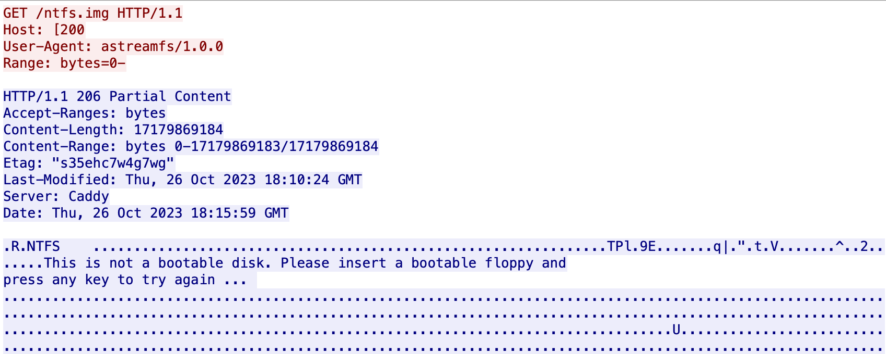
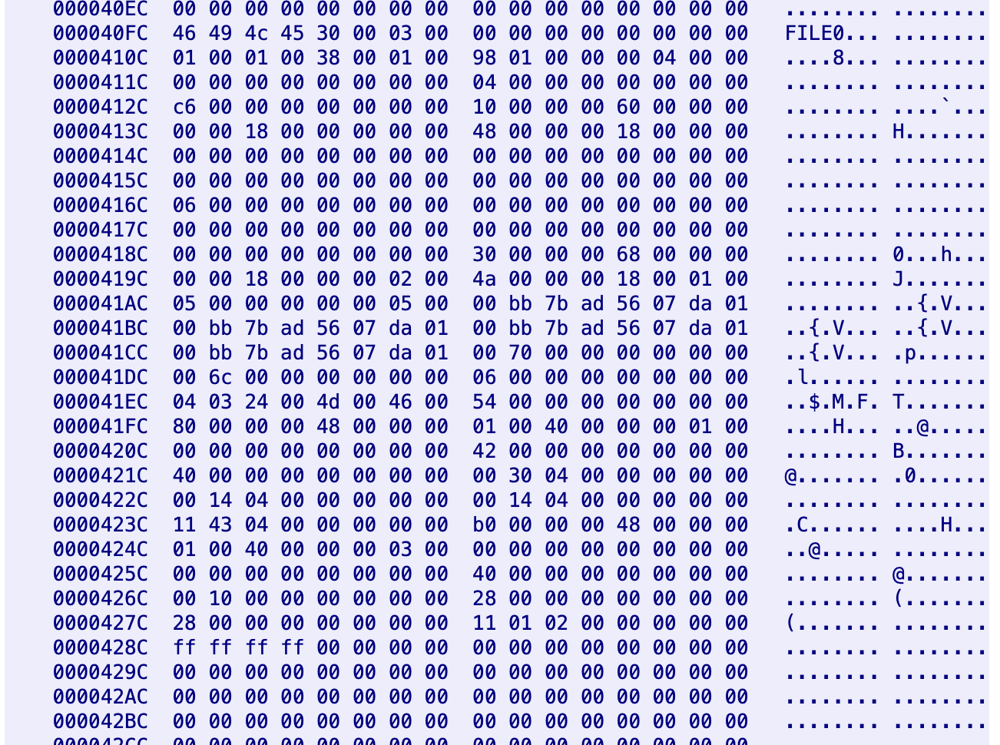
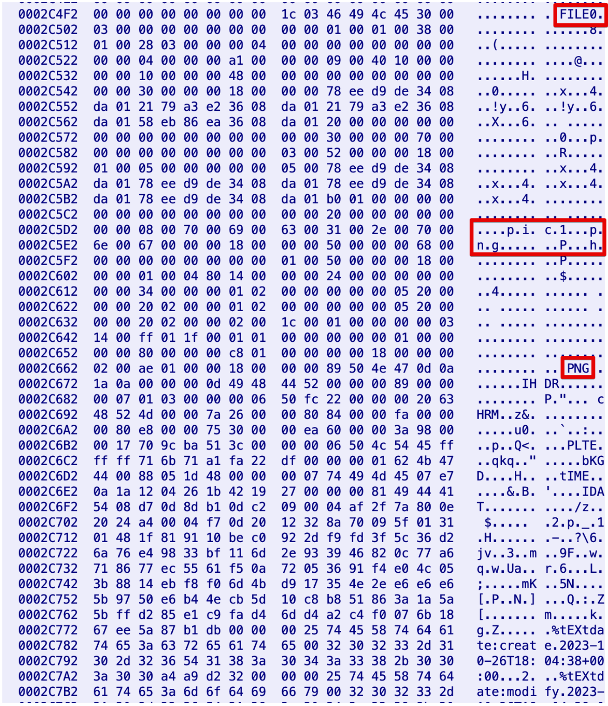
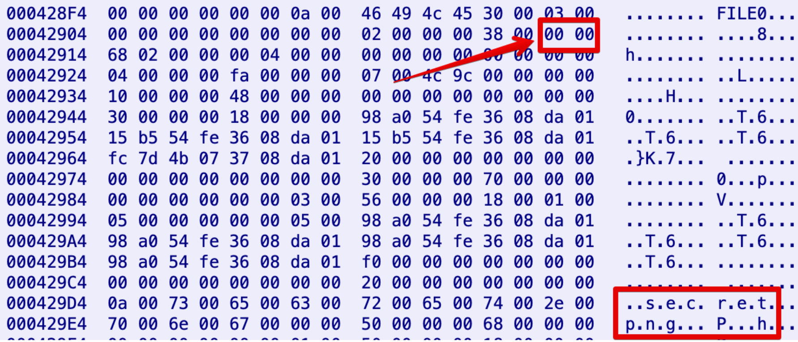
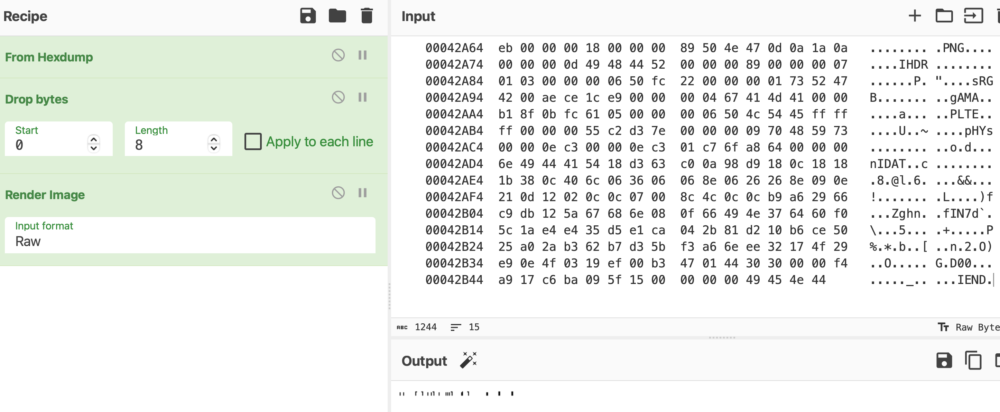
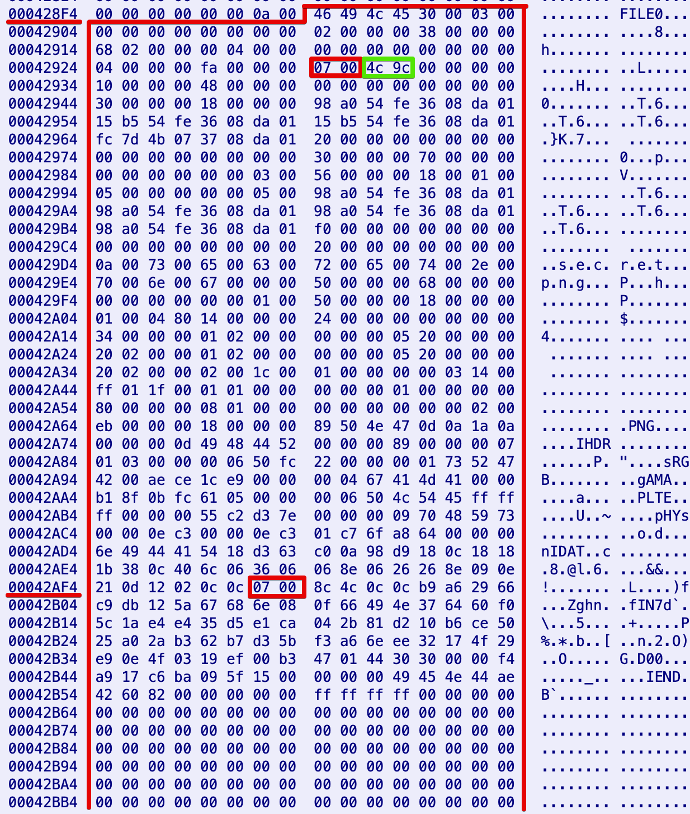
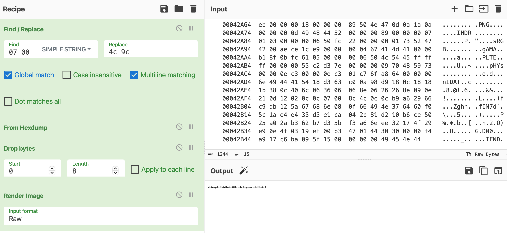

# Positve Tasks | NFS

## Information

> Злоумышенники использовали необычный способ доставки данных на зараженные хосты. Мы смогли перехватить такой трафик. 
> Что интересного они могли передать?

## Public

Provide pcap file: [public/astreamfs.pcap](public/astreamfs.pcap).

## Writeup (ru)

1. Первичный анализ дампа
Открыв astreamfs.pcap с помощью Wireshark или другого средства анализа дапмов трафика, увидим взаимодействие между двумя узлами:
201:a1b:aaaa:a44d:5ed5:4984:f335:c511 и 200:a1b:aaaa:19:58d9:b897:3409:7bed Судя по наличию HTTP запросов от первого ко второму, будем считать
[200:a1b:aaaa:19:58d9:b897:3409:7bed]:8000 сервером.

Одним из первых клиентских запросов выполняется GET /ntfs.img HTTP/1.1 , что может навести на мысли о том, что здесь может быть задействована файловая система NTFS.
Посмотрев на ntfs.img размером
ответа сервера является
дампа не получится. Других URL в дампе не замечено - стороны общаются исключительно через ntfs.img , причем клиентские запросы отличаются только заголовком Range . Также можно заметить заголовок User-Agent: astreamfs/1.0.0 . Изучив это ПО, можно попробовать повторить подобное взаимодействие, но для решения таска нам это не понадобится.

2. Анализ файловой системы NTFS

Из структуры NTFS мы знаем, что носитель делится на несколько ключевых зон. Одна из них - MFT, в которой содержатся записи о всех файлах носителя. В записях хранятся атрибуты, каждая запись имеет размер 1kb. Атрибуты бывают резидентные (хранятся прям в записи MFT, например, имя файла) и нерезидентные (чаще всего содержимое файла или каталога). Если атрибут данных достаточно маленький (до нескольких сотен байт, в зависимости от других атрибутов файла), может размещаться внутри записи MFT.
Проанализируем доступный нам кусочек таблицы MFT.

Первые 16 записей нас не интересуют - там содержатся служебные файлы для NTFS. Далее можно найти большое количество записей о файлах dataXXX , где XXX - число от 1 до 999. Какие-то из них резидентные, какие-то нет, но все они содержат высокоэнтропийные данные, так что останавливаться на них не будем. Так же, в MFT можно найти 50 PNG изображений с именами picXX , где XX - число от 1 до 50.

Интересно, но что еще? Продолжая шерстить MFT глазами или с помощью скрипта, можем найти файлик с названием secret.png , что даже по названию выглядит подозрительно. Так же, файл отмечен как удаленный, что так же добавляет к нему подозрений.

Попробуем его извлечь и посмотреть.

3. Извлекаем secret.png

Первым подходом к извлечению файла может стать использование условного binwalk или ручное извлечение данных из пакета. Попробуем извлечь руками и открыть как png. Для этого я воспользуюсь CyberChef: скопирую туда HexDump из Wireshark и попрошу его отобразить изображение с помощью рецепта Render Image .

Кажется, что что-то пошло не так - вместо вменяемого изображения наблюдаем какие-то палочки. Если попробуем открыть получившийся PNG другими средствами, можем получить ошибку или обрезанное изображение (а размер должен быть 137x7, судя по заголовку). Значит, что где-то в изображении есть измененные (испорченные) байты.

4. Возвращаемся в MFT

Важной особенностью записей MFT (которые размером по 1024 байта каждая) является наличие специальных маркеров USN в 510-511 и 1022-1023 байтах. Если атрибут (например, атрибут данных 0x80 , откуда мы извлекали содержимое secret.png ) попадает на эти оффсеты - данные переносятся в заголовок записи.
Проверим, не попали ли мы на этот сдвиг от начала записи.

Действительно, атрибут данных разместился ровно поверх USN (510-511 байты, offset 0x1FE-0x1FF ). Данные, которые USN перезаписал, находятся по оффсету 0x3a (зеленый
прямоугольник).

5. Восстанавливаем излеченный secret.png

Теперь у нас есть два недостающих байта: нужно положить их вместо 0x0007 и прочитать. Сделаем это с помощью CyberChef: поскольку других слов   в HexDump нет, заменим его строкой на нужные байты.

Полученное изображение содержит флаг

## Writeup (en)

1. Primary analysis of the dump
Opening astreamfs.pcap with Wireshark or other traffic dump analysis tool, we will see the interaction between the two nodes:
201:a1b:aaaa:a44d:5ed5:4984:f335:c511 and 200:a1b:aaaa:19:58d9:b897:3409:7bed Judging by the presence of HTTP requests from the former to the latter, let's count
[200:a1b:aaaa:19:58d9:b897:3409:7bed]:8000 сервером.

One of the first client requests is GET /ntfs.img HTTP/1.1 , which might suggest that the NTFS file system might be involved.
Looking at ntfs.img the size of the
of the server response is
the dump will fail. There are no other URLs in the dump - the parties communicate exclusively via ntfs.img , and client requests differ only by the Range header. You can also notice the User-Agent header: astreamfs/1.0.0 . Having studied this software, we can try to repeat such interaction, but we won't need it to solve the task.

2. Analyzing the NTFS file system

From the structure of NTFS, we know that the media is divided into several key zones. One of them is the MFT, which contains records of all files on the medium. The records store attributes, each record is 1kb in size. Attributes are resident (stored directly in the MFT record, e.g. file name) and non-resident (most often the contents of a file or directory). If the data attribute is small enough (up to several hundred bytes, depending on other file attributes), it can be placed inside the MFT record.
Let's analyze a piece of the MFT table available to us.

We are not interested in the first 16 records - they contain service files for NTFS. Further you can find a large number of records about files dataXXX , where XXX is a number from 1 to 999. Some of them are resident, some are not, but all of them contain high-entropy data, so we won't dwell on them. Also, in MFT you can find 50 PNG images with names picXX , where XX is a number from 1 to 50.

Interesting, but what else? Continuing to scour the MFT with our eyes or with the help of a script, we can find a file called secret.png , which even by its name looks suspicious. Also, the file is marked as deleted, which also adds suspicion to it.

Let's try to extract it and take a look.

3. extracting secret.png

The first approach to extracting a file may be to use a conditional binwalk or manually extract data from a package. Let's try to extract it manually and open it as a png. For this I will use CyberChef: copy the HexDump from Wireshark there and have it display the image using the Render Image recipe .

It seems that something went wrong - we see some sticks instead of a sane image. If we try to open the resulting PNG with other tools, we may get an error or a cropped image (and the size should be 137x7, judging by the title). It means that somewhere in the image there are changed (corrupted) bytes.

4. Back to MFT

An important feature of MFT records (which are 1024 bytes each) is the presence of special USN markers at 510-511 and 1022-1023 bytes. If an attribute (for example, data attribute 0x80 , from where we extracted the contents of secret.png) falls on these offsets - the data is moved to the record header.
Let's check if we hit this offset from the beginning of the record.

Indeed, the data attribute is placed exactly on top of the USN (510-511 bytes, offset 0x1FE-0x1FF ). The data that USN overwrote is located at offset 0x3a (green
rectangle).

5. Restore the cured secret.png

Now we have two missing bytes: we need to put them instead of 0x0007 and read them. Let's do it with CyberChef: since there are no other words in HexDump, we replace it with a string with the required bytes.

The obtained image contains a flag.

## Flag

ctfcup{r3sid3nt_fil3s_4r3_your_fri3nds}