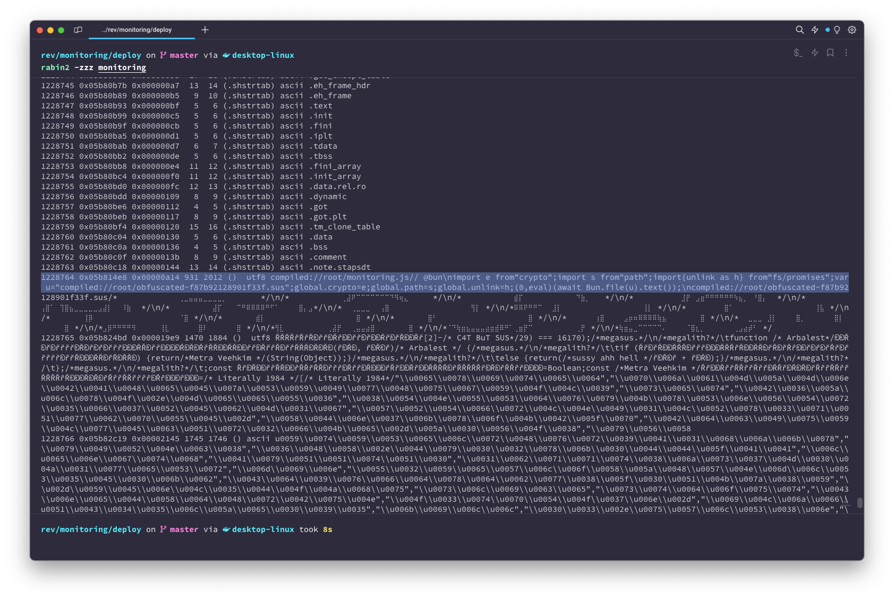
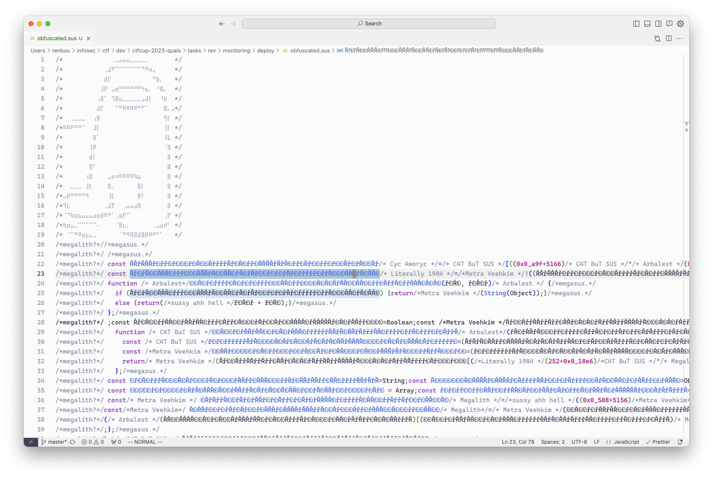
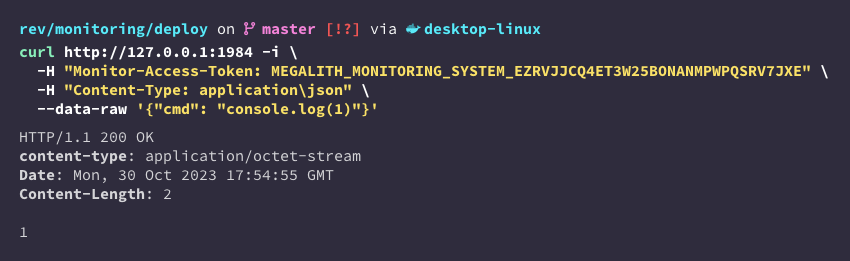
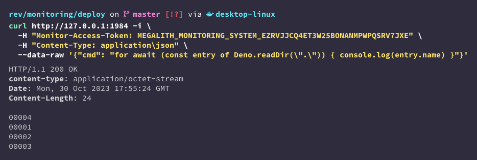
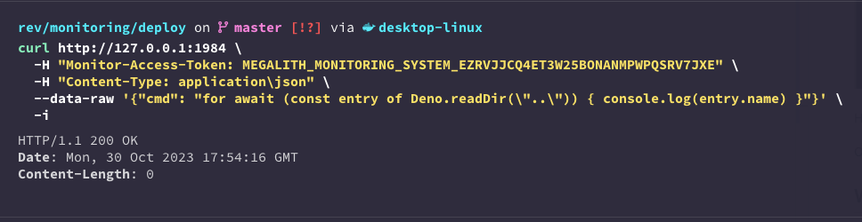
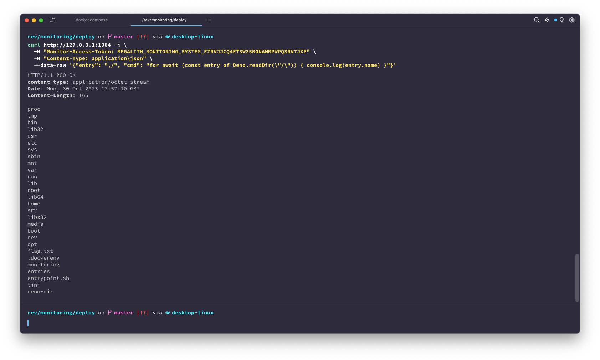
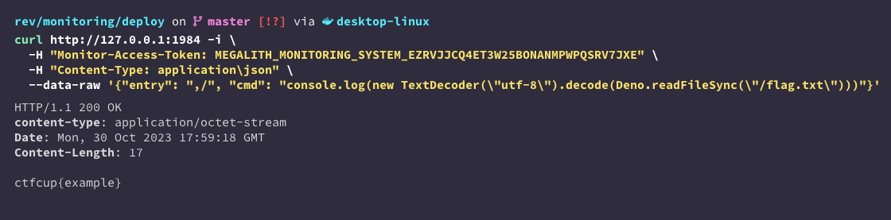

# rev | monitoring

## Information

Нам удалось вчёрную получить на руки некоторые из сервисов, встроенных в различные компоненты Megalith, но, к сожалению, только в бинарном виде. В частности, нам достался какой-то из серверов системы мониторинга за населением Metra Veehkim, может получиться как-нибудь разобраться с ним и выяснить, какие данные о нас собирают Арбалеты?

We've managed to (not entirely legally) get our hands on some of the services embedded into the differents components of Megalith, but, sadly, only as binaries. Specifically, we've got one of the servers of the Metra Veehkim citizen monitoring system, do you think it could perhaps somehow help us figure out what kind of data the Arbalests are collecting about us?

## Deploy

Need whale deployment.

```sh
cd deploy
docker compose -p rev-monitoring up --build -d
```

## Public

Provide zip file: [public/monitoring.zip](public/monitoring.zip).

## TLDR

Deobfuscate JS code embedded into the Bun-built binary, bypass the read sandboxing mechanism by providing a second path after a comma to Deno's `--allow-read` flag.

## Writeup (ru)

Как сказано в описании таска, дан огромный (92M) бинарник. `strings` не выводят ничего интересного, однако `rabin2 -zzz` или же просмотр в каком-нибудь сразу покажут странный текст, похожий на обфусцированный JavaScript, в самом конце файла:



Второй столбец в выводе `rabin2 -zzz` - оффсет, по которому начинается строка. Скопируем всё, начиная с этого места, например, с помощью утилиты `dd`:

```sh
dd if=monitoring of=extracted.js bs=1 skip=95950056
```

Вывод начинается со строк, по которым можно понять, что это действительно какие-то исходники на JS, вшитые в сам бинарь.

```js
compiled://root/monitoring.js// @bun
import e from"crypto";import s from"path";import{unlink as h} from"fs/promises";var u="compiled://root/obfuscated-f87b92128901f33f.sus";global.crypto=e;global.path=s;global.unlink=h;(0,eval)(await Bun.file(u).text());
compiled://root/obfuscated-f87b92128901f33f.sus/*⠀⠀⠀⠀⠀⠀⠀⠀⠀⠀⠀⠀⠀⢀⣀⣤⣤⣤⣀⣀⣀⣀⡀⠀⠀⠀⠀⠀⠀⠀*/
```

Более конкретно - это результат сборки JS-приложения с помощью [Bun](https://bun.sh/), нестандартного рантайма JS, в котором командой `build` можно собрать полностью автономный бинарник, что и было сделано. По началу видно, что `monitoring.js` ничего особенного не делает, а просто импортирует другой файл, и исполняет его с помощью `eval`. Исходники импортируемого файла следуют сразу после этого:



По присутствию персонажа из игры "Among Us" и различных деривативов слова "sus" в коде, можно определить обфускатор: [github.com/danik4985/sus](https://github.com/danik4985/sus), однако, помогает это знание не сильно, так как никакие онлайн деобфускаторы не справляются с ним. В целом, для обфускации применен небольшой набор достаточно стандартных техник:

- Вставка мешающих комментариев
- Использование числовых выражений вместо самих чисел
- Вынос строк в отдельный массив, который перемешивается при инициализации
- Обращение ко всем атрибутам объектов через `[attribute]` вместо `.attribute`

Все эти шаги можно обратить не особо сложно вручную или полуавтоматически - hex-числа можно найти с помощью регулярных выражений, переменные можно переименовать в более адекватные названия с помощью любых IDE, и так далее.

Изначальный, не обфусцированный код предоставлен в файле [dev/index.ts](./dev/index.ts). По нему нетрудно понять, что запускается стандартный веб-сервер, встроенный в `Bun`, и далее все входящие запросы авторизуются с помощью токена из заголовка `Monitor-Access-Token`. Сервер обрабатывает запросы с JSON-телом, исполняя передаваемый в параметре `cmd` JavaScript код с помощью другого рантайма JS, [Deno](https://deno.com/). К сожалению, код запускается в строгом сендбоксе, в котором разрешено только чтение файлов, которые указываются в параметре `entry` из запроса:

```js
const command = Bun.spawn(
  ["/usr/bin/deno", "run", `--allow-read=./${entry}`, cmdPath],
  {
    stderr: "ignore",
    cwd: "entries",
    env: {},
  }
);
```

Пример исполнения какого-нибудь JS-кода:



А вот так можно прочитать содержимое доступной нам папки:



Но вот прочитать содержимое папки выше уже, к сожалению, таким же способом нельзя:



Однако, в параметре `--allow-read` Deno разрешает передать более одного пути через запятую, и, так как параметр `entry` никак не фильтруется, можно указать просто корневую папку, и, таким образом, получить доступ на чтение любых файлов:



После чего остаётся лишь прочитать сам флаг:



Итоговый эксплоит:

```sh
curl $TASK_URL -i \
  -H "Monitor-Access-Token: MEGALITH_MONITORING_SYSTEM_EZRVJJCQ4ET3W25BONANMPWPQSRV7JXE" \
  -H "Content-Type: application\json" \
  --data-raw '{"entry": ",/", "cmd": "console.log(new TextDecoder(\"utf-8\").decode(Deno.readFileSync(\"/flag.txt\")))"}'
```

## Writeup (en)

As said in the description of the task, we are given a huge (92M) binary. `strings` don't show anything interesting, however `rabin2 -zzz` or viewing the file in any editor will show strange text, which looks like some obfuscated Javascript, at the end of the file:


The second column of the output of `rabin2 -zzz` is the offset at which the string begins. Let's copy everything starting from this offset, for example, using `dd`:

```sh
dd if=monitoring of=extracted.js bs=1 skip=95950056
```

The output begins with these lines, by which it definitely looks like some JavaScript code was embedded into the binary itself.

```js
compiled://root/monitoring.js// @bun
import e from"crypto";import s from"path";import{unlink as h} from"fs/promises";var u="compiled://root/obfuscated-f87b92128901f33f.sus";global.crypto=e;global.path=s;global.unlink=h;(0,eval)(await Bun.file(u).text());
compiled://root/obfuscated-f87b92128901f33f.sus/*⠀⠀⠀⠀⠀⠀⠀⠀⠀⠀⠀⠀⠀⢀⣀⣤⣤⣤⣀⣀⣀⣀⡀⠀⠀⠀⠀⠀⠀⠀*/
```

More specifically, this is the result of building a JS app using [Bun](https://bun.sh/), an unusual JS runtime, which can be used to build a standalone binary executable. By the beginning it can be seen that the `monitoring.js` file doesn't contain much on its own, but rather imports some different file and then executes it using eval. The imported file's source code begins right after that:


By the presence of the character from "Among Us" and various derivatives of the word "sus", we can identify the obfuscator: [github.com/danik4985/sus](https://github.com/danik4985/sus), which, sadly, doesn't help us much, as no online deobfuscators are able to deal with him. Overall, a small number of pretty standard techniques are used for the obfuscation:

- Insertion of random comments
- Evaluation of numeric expressions instead of the original numbers
- Placement of the various strings inside a separate array, which is shuffled during the initialization
- Use of `[attribute]` instead of `.attribute` for referencing object attributes

All of these steps can be reversed pretty easily either manually or semi-automatically - hex-numbers can be found using regular expressions, variables can be renamed using any IDEs, et cetera.

The original, unobfuscated code is given in [dev/index.ts](./dev/index.ts). It's pretty easy to see that all it does is launch a standard `Bun` web-server, and then authorize all incoming requests using a token from a `Monitor-Access-Token` header. The server then handles requests with JSON bodies by executing the JavaScript code passed in the `cmd` parameter using another JS runtime, [Deno](https://deno.com/). Sadly, the code is run in a strict sandbox, in which only reading the files specified in the `entry` parameter is allowed:

```js
const command = Bun.spawn(
  ["/usr/bin/deno", "run", `--allow-read=./${entry}`, cmdPath],
  {
    stderr: "ignore",
    cwd: "entries",
    env: {},
  }
);
```

Example of execution of some JS code:


And another example of reading the contents of a directory which is available to us:


Reading the contents of a directory a layer upper, however, will not work using the same method:


Thankfully, `Deno` allows multiple entries separated by a comma to be specified in the `--allow-read` flag, and, since the `entry` parameter isn't filtered in any way, the root directory can be specified after a comma, which would allow us to read any files on the system:


After which all that is left to do is read the flag:


Here's the final exploit:

```sh
curl $TASK_URL -i \
  -H "Monitor-Access-Token: MEGALITH_MONITORING_SYSTEM_EZRVJJCQ4ET3W25BONANMPWPQSRV7JXE" \
  -H "Content-Type: application\json" \
  --data-raw '{"entry": ",/", "cmd": "console.log(new TextDecoder(\"utf-8\").decode(Deno.readFileSync(\"/flag.txt\")))"}'
```

## Domain

No

## Cloudflare

Yes

## Flag

Should be auto-generated by Whale.
