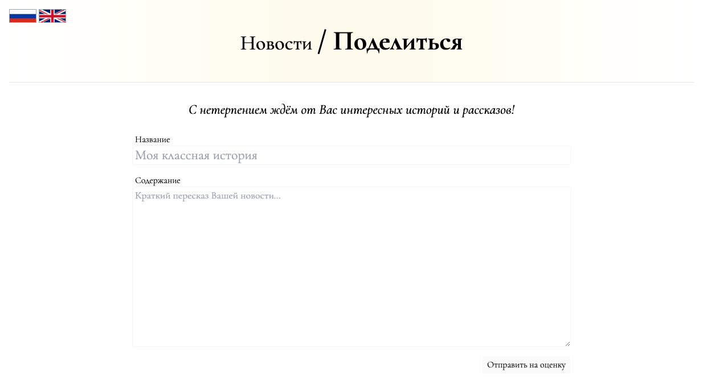

# web | novosti



## Information

Даже в такие тяжёлые времена, как сейчас, людям нужна информация. Мы решили запустить свой новостной сайт, но только так, чтобы об этом не узнали сам-знаешь-кто. Надеемся, очевидцы будут присылать нам новости, чтобы было, что публиковать. Не самим же искать анонсы, в самом-то деле...

Even in hard times like these, people need information. We have decided to start our own news site, but only so that you-know-who doesn't find out about it. We hope that eyewitnesses will send us news so that we have something to publish. It's not like we have to look for announcements ourselves, really....

[https://novosti-3d5d54b8c9f9f81aabcf60563021845f.ctfcup-2023.ru](https://novosti-3d5d54b8c9f9f81aabcf60563021845f.ctfcup-2023.ru)

## Deploy

```sh
cd deploy
NOVOSTI_FLAG="ctfcup{flag}" docker compose -p web-novosti up --build -d
```

## Public

Provide zip file: [public/novosti.zip](public/novosti.zip).

## TLDR

Classic XSS task with CSP bypass by framing a `40x` page with missing CSP.

## Writeup (ru)

На странице просмотра предложенных новостей, которая доступна только админу, присутствует XSS из-за использованного метода `raw`, который вставит переданный ему аргумент не применяя какой-либо санитизации ([deploy/service/app/views/Admin/View.html#L7](./deploy/service/app/views/Admin/View.html#L7)). К сожалению, приложение имеет достаточно строгую CSP политику, которая выставляется в фильтре, устанавливаевом при инициализации приложения в файле [deploy/service/app/init.go](./deploy/service/app/init.go):

```go
var HeaderFilter = func(c *revel.Controller, fc []revel.Filter) {
	c.Response.Out.Header().Add("X-Frame-Options", "SAMEORIGIN")
	c.Response.Out.Header().Add("Content-Security-Policy", "default-src 'self'; base-uri 'none'; object-src 'none'; script-src 'self' 'unsafe-inline' https://www.google.com/recaptcha/ https://www.gstatic.com/recaptcha/; style-src 'self' 'unsafe-inline'; frame-src 'self' https://www.google.com/recaptcha/ https://recaptcha.google.com/recaptcha/;")

	fc[0](c, fc[1:])
}
```

Данная CSP политика не позволяет инициировать соединения к каким-либо ресурсам, кроме самого сайта (правило `default-src 'self'` используется в качестве `connect-src`, т.к. оно в явном виде не присутствует), что необходимо для решения таска, так как флаг доступен в локальной сети на сервисе `files`, который содержит nginx, раздающий файл именно с необходимой нам CORS-политикой, "`Access-Control-Allow-Origin http://service:9000`".

Однако, приложение применяет эти фильтры в не совсем корректном порядке:

```go
func init() {
	revel.Filters = []revel.Filter{
		revel.PanicFilter,             // Recover from panics and display an error page instead.
		revel.RouterFilter,            // Use the routing table to select the right Action
		revel.FilterConfiguringFilter, // A hook for adding or removing per-Action filters.
		revel.ParamsFilter,            // Parse parameters into Controller.Params.
		revel.SessionFilter,           // Restore and write the session cookie.
		revel.FlashFilter,             // Restore and write the flash cookie.
		revel.ValidationFilter,        // Restore kept validation errors and save new ones from cookie.
		filters.I18nFilter,            // Resolve the requested language
		HeaderFilter,                  // Add some security based headers
  ...
```

Из-за чего ответ на любые запросы, обработка которых не дойдёт до этого фильтра, не будут содержать CSP политику. Так, например, запрос на любой несуществующий эндпоинт, то есть тот, который не определён в файле `routes` фреймворка ([deploy/service/conf/routes](./deploy/service/conf/routes)), например `/404`, вернёт ответ без заголовка `Content-Security-Policy`.

Благодаря этому можно создать `iframe` на такую страницу, после чего на ней уже исполнить нужный JS код без каких-либо ограничений. POC:

```html
<script>
  const iframe = document.createElement("iframe");
  iframe.src = "/404";
  document.body.appendChild(iframe);
  setTimeout(() => {
    iframe.contentWindow.document.body.innerHTML = ``;
  }, 1000);
</script>
```

Полноценный эксплоит должен быть написан без переноса строк, и доступен в файле [solve/xss.txt](./solve/xss.txt).

## Writeup (en)

An XSS is present on the suggested news review page, which is available to the admin, due to usage of the `raw` method inside the page's template, which inserts the given argument without performing any sanitization ([deploy/service/app/views/Admin/View.html#L7](./deploy/service/app/views/Admin/View.html#L7)). Sadly, the application contains a pretty strict CSP policy, which is set inside a filter, specified during the initialization of the app in [deploy/service/app/init.go](./deploy/service/app/init.go):

```go
var HeaderFilter = func(c *revel.Controller, fc []revel.Filter) {
	c.Response.Out.Header().Add("X-Frame-Options", "SAMEORIGIN")
	c.Response.Out.Header().Add("Content-Security-Policy", "default-src 'self'; base-uri 'none'; object-src 'none'; script-src 'self' 'unsafe-inline' https://www.google.com/recaptcha/ https://www.gstatic.com/recaptcha/; style-src 'self' 'unsafe-inline'; frame-src 'self' https://www.google.com/recaptcha/ https://recaptcha.google.com/recaptcha/;")

	fc[0](c, fc[1:])
}
```

This CSP policy doesn't allow initiation of connections to any resources besides the website itseld (the `default-src 'self'` rule is used for `connect-src` since it isn't present), which is needed to solve the task, as the flag is hosted in the local network on the `files` service, which contains an nginx serving files with the exact CORS-policy that we need, "`Access-Control-Allow-Origin http://service:9000`".

However, the application runs its filters in an incorrect order:

```go
func init() {
	revel.Filters = []revel.Filter{
		revel.PanicFilter,             // Recover from panics and display an error page instead.
		revel.RouterFilter,            // Use the routing table to select the right Action
		revel.FilterConfiguringFilter, // A hook for adding or removing per-Action filters.
		revel.ParamsFilter,            // Parse parameters into Controller.Params.
		revel.SessionFilter,           // Restore and write the session cookie.
		revel.FlashFilter,             // Restore and write the flash cookie.
		revel.ValidationFilter,        // Restore kept validation errors and save new ones from cookie.
		filters.I18nFilter,            // Resolve the requested language
		HeaderFilter,                  // Add some security based headers
  ...
```

Which is why the response to any requests, the handling of which doesn't reach this filter, will not contain the CSP policy. This way, any request to an unexistent endpoint, which is any route not defined in the framework's `routes` file ([deploy/service/conf/routes](./deploy/service/conf/routes)), for example `/404`, will result in a response without the `Content-Security-Policy` header.

Thanks to this it is possible to create an `iframe` leading to such page, and then run any JS codes in the iframe without any further limits. POC:

```html
<script>
  const iframe = document.createElement("iframe");
  iframe.src = "/404";
  document.body.appendChild(iframe);
  setTimeout(() => {
    iframe.contentWindow.document.body.innerHTML = ``;
  }, 1000);
</script>
```

For actual exploitation the exploit needs to be written without line breaks, and is available in the file [solve/xss.txt](./solve/xss.txt).

## Domain

https://novosti-3d5d54b8c9f9f81aabcf60563021845f.ctfcup-2023.ru

## Cloudflare

Yes

## Flag

ctfcup{b4by-1fr4m3-x55-a4371ea843fc145f}
